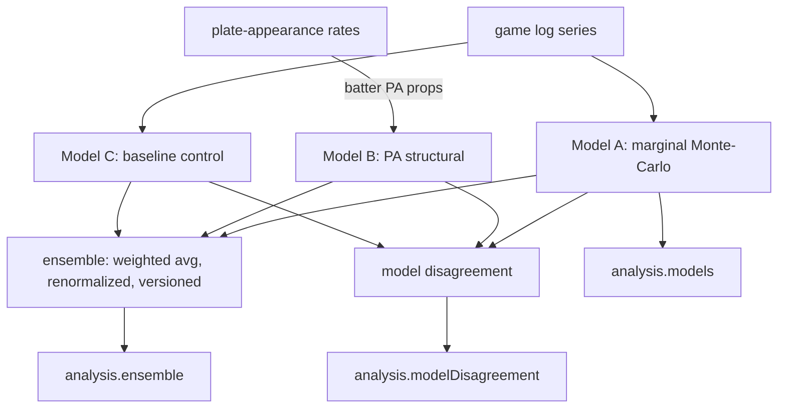

# Graph-of-Loops Architecture

Diamond Edge is evolving from a linear `request → fetch → projection → simulation
→ recommendation` pipeline into a typed **Graph-of-Loops**: parallel data
acquisition → validation → features → **parallel deterministic models** →
ensemble → calibration → deterministic verification → immutable pregame snapshot
→ actual result → grading → measured improvement.

**The statistical engine is the foundation and is never replaced by an LLM.** LLMs
may later assist with research/news interpretation and natural-language
explanation only — they never compute MLB probabilities, replace Monte Carlo, or
modify projections. The runtime stays deterministic and reproducible (seeded RNG).

## What already exists (reused, not rebuilt)

- **Pure engine**: `src/lib/prediction/{projection,simulate,paSim,adjustments,quality}`,
  `src/lib/math`, `src/lib/analytics`, `src/lib/odds`, `src/lib/props`.
- **Graph engine**: `src/workflows/graph` (typed nodes, executor with topological
  ordering, bounded fan-out/fan-in, retry/timeout/budget, `WorkflowTrace`,
  `Result` — errors as values). Workflows: `player-prop`, `player-prop-analysis@2`,
  `prizepicks-*`, `followed-player-performance@1`.
- **Measurement**: `src/lib/backtest` (Brier, log loss, calibration buckets,
  MAE/RMSE, drift/PSI). Calibration model: `src/lib/prizepicks/opportunity/calibration`.
- **Snapshots / persistence**: `src/lib/prizepicks/ingestion/snapshot`, Supabase
  scientific tables (`feature_snapshots`, `projection_snapshots`,
  `decision_snapshots`, `official_results`, `grading_history`, …) — append-only,
  point-in-time, RLS-guarded.
- **Providers**: `src/lib/providers/{mlbStats,statcast,arsenal,park,health}`.

## What this phase added — parallel models (`src/lib/models/`)

Three **deterministic** models run over the same prop, then blend:

- **Model A — marginal** (`simulate` on the context-adjusted `project()`): always present.
- **Model B — PA structural** (`simulatePlateAppearances`): present only for
  PA-modeled batter props; leads the ensemble when present.
- **Model C — baseline** (`baselineModel`): a deliberately simple recency-weighted
  control with **no context** — a richer model that cannot beat it is not adding value.
- **Ensemble** (`buildEnsemble`): versioned weighted average
  (`MODEL_WEIGHTS = { pa:0.5, marginal:0.35, baseline:0.15 }`), **renormalized over
  present models**; a missing model is never fabricated; the three probabilities
  always sum to 1; individual contributions preserved.
- **Disagreement** (`computeDisagreement`): deterministic spread
  (`probabilityRange`, `projectionRange`, `stdDevProbability`) → `low|medium|high`.
  Feeds reliability/warnings/ranking; it never changes the projection.

### Wiring (additive, backward compatible)

`runAnalysis` computes the marginal sim once (Model A), reuses the PA sim when
present (Model B), and calls `computeModelEnsemble`. The result is attached to the
existing `analysis` object as **new** fields — `analysis.models`,
`analysis.ensemble`, `analysis.modelDisagreement` — leaving `analysis.recommendation`
and every other field unchanged. The research view model surfaces them in the
Diamond Edge Model block (per-model rows + ensemble + a disagreement badge).

## Failure behavior

Independent acquisition already degrades per-section (weather/lineup/opponent
missing → reduced data quality + warning, never a silent "complete"). A missing
model reduces the ensemble to the present models and raises a warning; it is never
invented. No probability is fabricated; missing evidence is `N/A`/`unavailable`.

## Versioning

- `MODEL_VERSION` (engine, `src/lib/mlb/analysis`) — unchanged; the marginal/PA
  models are not modified this phase.
- `MODEL_ENSEMBLE_VERSION = "1.0.0"` (`src/lib/models/types`) — the blend logic/weights.
- `BASELINE_MODEL_VERSION = "baseline-1.0.0"` — the control model.

A change to blend weights bumps the ensemble version; a change to engine
coefficients bumps `MODEL_VERSION` and must be justified by a walk-forward
backtest improvement (see `BACKTESTING.md`), never tuned on the reported set.
